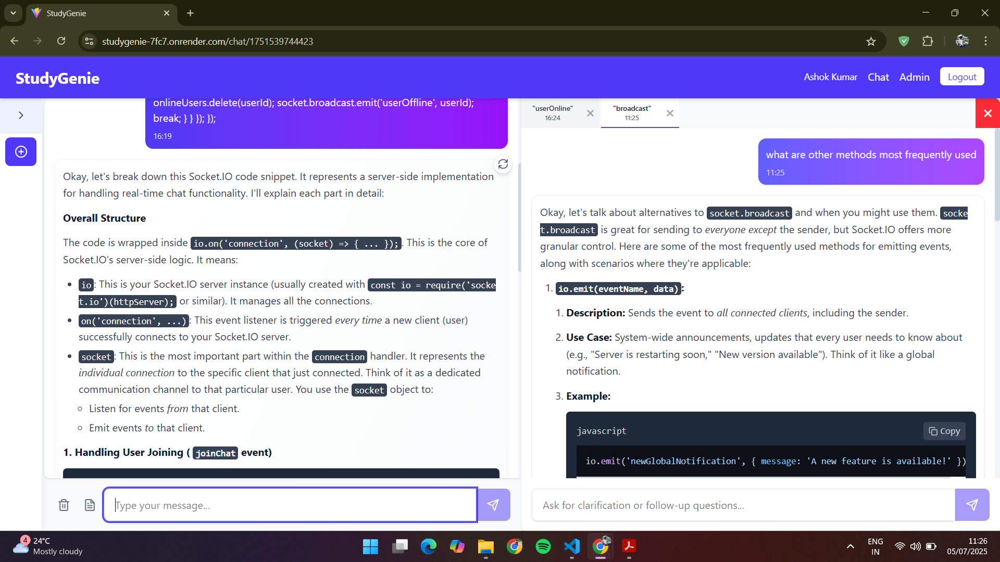

# StudyGenie 🎓🤖

An AI-powered learning assistant with contextual side chats, intelligent summaries, and PDF export for seamless study sessions.

---

## 🚀 Live Demo & Repo

* 🔗 [Live App](https://studygenie-7fc7.onrender.com/)
* 🎥 [Video Walkthrough](https://youtu.be/your-demo-link)

---

## ✨ Key Features

* **Smart Chat**: AI-driven Q\&A using Google Gemini API with markdown support
* **Side Chat Panel**: Highlight any text and ask follow-ups in the side chat without disrupting the flow of main chat or losing context
* **Session Summaries**: Generate and review AI-crafted summaries of your chats
* **PDF Export**: Download professional study reports (main + side chats)
* **User Profiles**: Persistent accounts, chat history, and personalized settings
* **Admin Dashboard**: Manage users, monitor analytics, and oversee chat activity

---

## 🔍 Tech Stack

| Layer     | Technology                   |
| --------- | ---------------------------- |
| Frontend  | React 18, Vite, Tailwind CSS |
| Realtime  | Socket.io Client             |
| Backend   | Node.js, Express.js          |
| Database  | MongoDB, Mongoose            |
| AI Engine | Google Gemini API            |
| Auth      | JWT, bcrypt                  |

---

## 🏁 Quick Start

1. **Clone Repo**

   ```bash
   git clone https://github.com/ashokkumar.272/StudyGenie.git
   cd StudyGenie
   ```
2. **Backend Setup**

   ```bash
   cd backend
   npm install
   cp .env.example .env
   npm run dev
   ```
3. **Frontend Setup**

   ```bash
   cd ../frontend
   npm install
   npm run dev
   ```
4. **Open** `http://localhost:5173` to use the app

---

## 🔧 Configuration

Copy `.env.example` to `.env` in **backend** folder and fill in:

```env
MONGODB_URI=<your_mongo_uri>
JWT_SECRET=<your_jwt_secret>
GEMINI_API_KEY=<your_gemini_api_key>
PORT=5000
FRONTEND_URL=http://localhost:5173
```

---

## 📸 Screenshots


*Main AI chat interface with markdown responses*

<!-- 
*Contextual side panel for follow-ups*


*AI-generated summary exported as PDF* -->

---

## 🧠 What I Learned

* Integrated Google Gemini API for advanced AI responses
* Managed Socket.io for real-time, context-aware messaging
* Built dynamic PDF generation combining main and side chats

---

## 📂 Project Structure

```
StudyGenie/
├── backend/
│   ├── controllers/        # Business logic modules
│   ├── middleware/         # JWT auth and error handlers
│   ├── models/             # Mongoose schemas
│   ├── routes/             # Express route definitions
│   └── index.js            # Server entry with Socket.io setup
├── frontend/
│   ├── public/             # Static assets
│   ├── src/
│   │   ├── components/     # UI elements
│   │   ├── context/        # React Context providers
│   │   ├── hooks/          # Custom hooks (useAuth, useChat)
│   │   └── App.jsx         # Main application component
│   └── vite.config.js      # Vite config
├── .env.example            # Sample environment variables
├── package.json
└── README.md
```

---

## 🔌 API Endpoints

### Authentication

* `POST /api/auth/register` — Register a new user
* `POST /api/auth/login` — Login and receive JWT
* `GET /api/auth/me` — Get current user profile

### Chat & Side Chat

* `POST /api/chat/message` — Send main chat message
* `POST /api/chat/side-message` — Send side chat message
* `GET /api/chat/history/:sessionId` — Fetch entire session

### Summaries & PDFs

* `POST /api/chat/generate-summary` — Create session summary
* `POST /api/chat/export-pdf` — Generate and download PDF
* `GET /api/chat/summaries/:userId` — List all summaries

### Admin

* `GET /api/admin/users` — List all users (admin only)
* `GET /api/admin/stats` — Platform analytics (admin only)

Socket.io Events: `connection`, `join`, `message`, `sideMessage`, `disconnect`

---

## 🤝 Contributing

1. Fork the repo
2. Create a branch (`git checkout -b feature/your-feature`)
3. Commit your changes (`git commit -m 'Add feature'`)
4. Push (`git push origin feature/your-feature`)
5. Open a Pull Request

---

## 📄 License

ISC License — see [package.json](./package.json) for details.

---